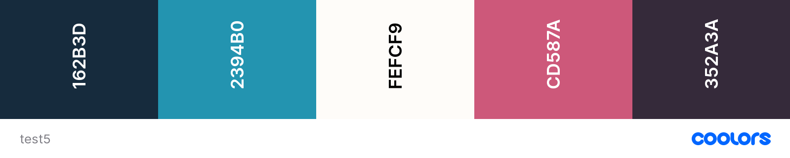
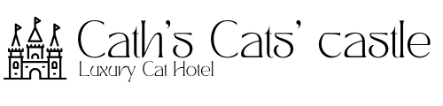
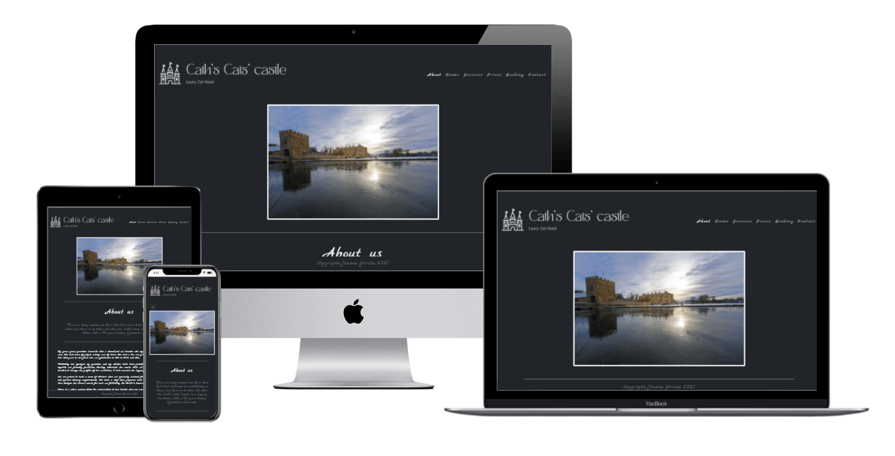
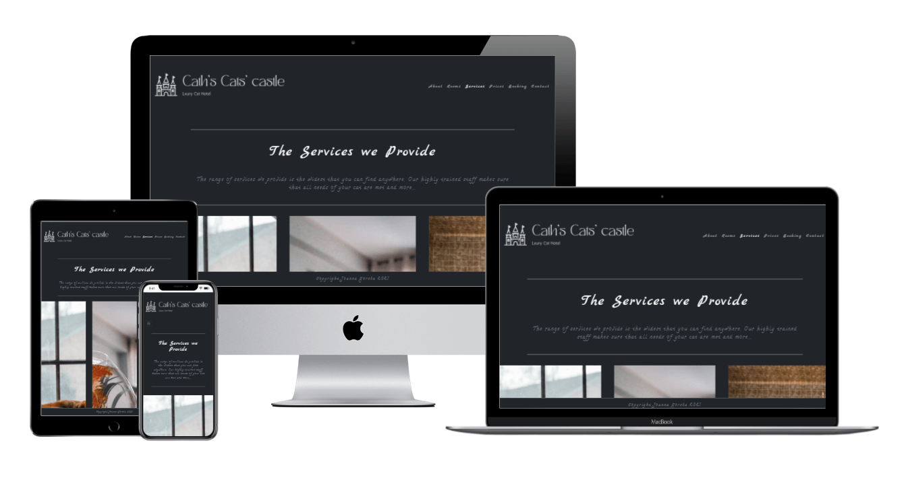
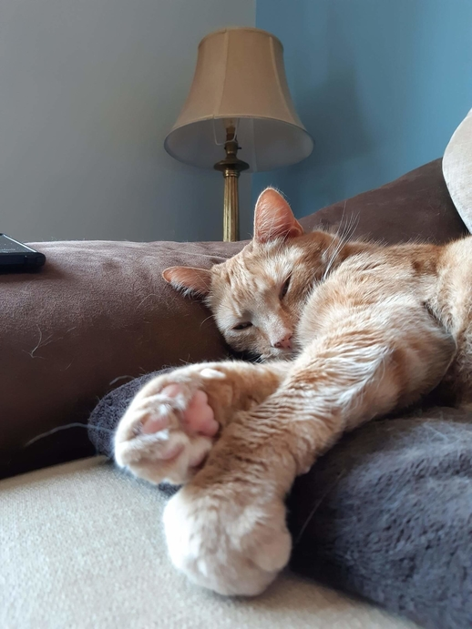

# Luxury Cat Hotel
## Description

The website shows a fictious cattery called "Cath's cats' Castle - Luxury Cat Hotel". The purpose of this website is to encourage users to book their cats to stay in the cattery. The website highlights the benefits and uniquness of the cattery, by focusing on beautiful photos of interior, rather than cats. 

This website was created to complete the first Milestone Project for the Code Institute's Diploma in Software Development (E-commerce Applications). 

## Deployment and Live demo

### How to clone this page
1. Go to Github repository for [Luxury Cat Hotel](https://github.com/JoGorska/Luxury_cat_hotel)

2. Next to the green gitpod button you will see a button "code" with arrow pointing down 
3. You are given two options to open Github desktop or download zip

### How to deploy the page

1. Go to github repository for [Luxury Cat Hotel](https://github.com/JoGorska/Luxury_cat_hotel)

2. Go to Settings

3. You will see menu on the left with options, manage access and others, you will find Pages at the end of this menu

4. Choose source - master (or your branch) and click on Save

5. You should see the information showing on a blue background "Your site is ready to be published" and showing the link

6. Refresh the page (Github repository settings, were you were)

7. The information should change to green background and show "Your site is published.." and give you address.

## User Experience (UX)
### User stories

#### First Time Visitor
- As a first time visitor, I what to know What sort of accomodation the website describes

- As a first time visitor, I would like get to know the people that run the cattery
- As a first time visitor, I want to be check the cost of accomodating my cat so I could compare easily with offers of other catteries
- As a first time visitor, I want to be able to check what services the cattery provieds
- As a first time visitor, I want to be able to see the phtotos of accomodation available
- As a first time visitor, I need to be able to check if cattery accomodates for complex healthcare and diet requirements
- As a first time visitor, I want to know the address and location of the cattery to be able to go and visit
- As a first time visitor, I want to be able to contact the owners' of the cattery for more information

#### The goals were accomplished in the following ways:
- The name of the website reffers to cats and is clearly visible in top left corner in mobile view and pc
- the home page describes history of the owners' of the cattery
- the prices page is accessible via nav bar button and prices are written in visualy simple cards form
- the services are accessible via nav bar link
- the photos of the rooms are available to view on the page rooms.html
- the page services describes that the cattery is accomodating all healthcare and diet requirements
- the contact page shows the google maps and full address of the cattery
- the contact page contains a simple form to fill in to get in touch with the owners'

#### Returining Visitor
- As a returning visitor, I need to access the booking form quickly

#### Goals were accomplished in the following ways
- the visitor can navigate from home page to booking using nav bar button

### Brand and visual identity

#### Colors palette and Color inspiration

The inspiration for this website is warm dark interiors of some traditional English Coutnryside houses. 

Dark color scheme of the website seems to be eye friendly and can evoke warmness and cosyness of the interiors presented. 

Oryginally different colors were going to be applied to fonts, borders and other elements as decoration, to ad vibrancy and interest. I have chosen the below palette.

Due to efficiency of working with Bootstrap I followed dark color scheme with limited input of standard Bootstrap's colors.

#### Logo

Appropriately to the page story and page title - the logo has been created using [Canva website](https://www.canva.com/). The logo features an icon of a castle. The square logo was going to be used as menu toggler for mobile phone users, but the idea was dropped, as it was not intuitive for the user. User expects the menu to be under very popular hamburger button. 

Long version of the logo has been created using icon of the castle and TAN Mignon fonts. This logo was used in navbar.

#### Typography

[TAN Mingon](https://creativemarket.com/tantype/5831510-TAN-MIGNON?u=filepolitan) is font family used in logo only. This was chosen for very attractive visual effect, being inspired by art deco design. Unfortunately they could not have been used within the website as they didn't seem to be available free to use. 

Font family was chosen from popular styles of google fonts. The style of the headers is mimicking handwriting giving the viewer an impression of a personal touch from the owner of the website. Following this idea [Marck Script](https://fonts.google.com/specimen/Marck+Script?category=Handwriting#standard-styles) was chosen as the font for headers. The choise was taking into consideration that the user needs the fonts to be easy to read. Plain text requires much plainer fonts than headers. [Roboto](https://fonts.google.com/specimen/Roboto?query=robo) fonts for plain text. The plain text font was chosen from the fonts offered by google fonts as popular pairing. 

## Features

### Existing Features

- gallery of photos for rooms for user to see what accomodation is available
- short description of various services provided by the cattery
- clear distinction of pricing per week with table view explaining what is included in each package
- extensive and detailed booking form, allowing to inform the cattery about all needs of the cat
- short contact form allowing the user to fill in quickly

### Future developement of the website and new features
- Two stages registration 

            1. Calendar (check if date available)
            2. Booking form with all details

- New Calendar page would consist of 9 calendars - one for each room. This page would replace Booking page in navigation - so the user would be directed to the calendar to choose the room and check the dates
- existing booking.html would become the booking form page - where the user would fill in all the details knowing that the dates are available
- pop up advert - to advertize special deals, to encourage users to fill in empty spaces between bookings or short notice cancellations
- Caruselle with more photos of the rooms, to enable the user to immerse in watching beautiful photos of interiors

## Testing

- Google chrome dev tools
- [Unicorn revealer](https://chrome.google.com/webstore/detail/unicorn-revealer/lmlkphhdlngaicolpmaakfmhplagoaln?hl=en-GB) Chrome plugin

- [Lighthouse](toohttps://chrome.google.com/webstore/detail/lighthouse/blipmdconlkpinefehnmjammfjpmpbjk) to audit the site (efficiency)

- [Validator](https://validator.w3.org/)

- [Jigsaw](https://jigsaw.w3.org/css-validator)

### Issues and Bugsad

- style.css not accepting images to card background - as the file name were containing white space
- rooms.html very wide white space on both sides (left and right) of the grid in max width view. Used Unicorn revealer to find which element is causing it. Found that .container has set max width 960px by bootstrap. Used chrome dev tools to test solution - set max-width to 100vw. This has removed the white space. Tested on other view port sizes. No white space left. Added class to adjust max-width.
- some bootstraps classes didn't seem to be working on some of the pages. I have realised that I have put link for Bootstrap 4 in some of the pages, while other pages were using Bootstrap 5. I changed all pages to Bootstrap 5 as it was dealing with the grid of the images in rooms very well. 
- defauld bootstrap grid in rooms was planned to change  from 1 column to 3 columns depending on the width of viewport. This seemed inapropriate for tablets or big mobile phones held sideways. Tested on my Samsung Galaxy Note. Adjusted bootstrap classess and html structure to allow 1 or 2 or 3 columns depending of view port width. 
- toggler in nav bar not working, menu wasn't dropping down, replaced bootstrap css stylesheet link and added js link, which solved the problem
- mobile phone menu was covered by arrow - from the image that is pointing down. Added high z-index to nav-bar which has solved the problem. 
- at later stages arrow was removed from the page
- once the page was deployed it was not displaying correctly as if not connecting to stylesheet and not seeing the images in the folder. Replaced the absolute filepaths with relative filepaths, the same done with all links which has solved the problem
- main header in cards in prices was displaying on top of the other text. Checked css - it seemed that I was trying to edit the bootstrap's clases for cards. Changed my classes to add my- at the beggining of each class. This has solved the problem. 

### Removed Features

- Contact page was going to include a map and link to social media. Unfortunately those features had to be removed due to lack of time.
- Oryginaly the Big images at the top of each page were going to be full width with an arrow pointing down to slide down the page. Unfortunately some of the pictures' quality did not allow them to be display in this way. Used Thumbnail instead. 

## Scalability

The page was designed with mobile phone users in mind. The images and tables are responsive. 

The grid used in rooms and services allows the user to view the images in 1, 2 or 3 columns, depending on view port width.

## Technologies

### Languages and Frameworks
- HTML
- CSS
- Bootstrap

### Tools used
- Bootstrap examples zip package
- Google Chrome dev tools and Unicorn Revealer for debugging
- Google Lighthouse for audits
- Stack Overflow 

## Acknowledgements

- accessibility of icons for screen readers users 
https://fontawesome.com/v5.15/how-to-use/on-the-web/other-topics/accessibility

- pattern for emails - input form validation for emails and other uses of pattern attribute https://www.w3schools.com/tags/att_input_pattern.asp

- UK counties drop down list 
https://gist.github.com/olivertappin/4dcbf64e06aae132c12a8b9d302fae12

- Color  https://coolors.co/

- compressing of the photos https://tinypng.com/

- created logo https://www.canva.com/

- Readme file followed the pattern in the below mentioned repositories and video

https://us02web.zoom.us/rec/play/zZzrdRcJ1Gz9isoaRTUcHNhB1VEqzkhcI4kkOUXEbTGTShtMaNQEpxYE7dW214K5X2OWveSRPLL-oWtA.5EMQT2YvoO2ZLIox?autoplay=true

https://github.com/Daisy-McG/MilestoneProject-1#frequent-visitor-goals

https://github.com/LigaMoon/Boredom-guide#technologies

https://github.com/jumboduck/Polygonal-Brewing-Co/blob/master/README.md

- Dave Horrocks & Brian Smyth - for general help on how to use bootstrap's navbar's images, responsivness and styling, shared during Hackaton and applied in this project

- Felippe Souza Alarcon - for mentoring, guidance, technical advice and moral support

- Tiger called Ginger for inspiration

