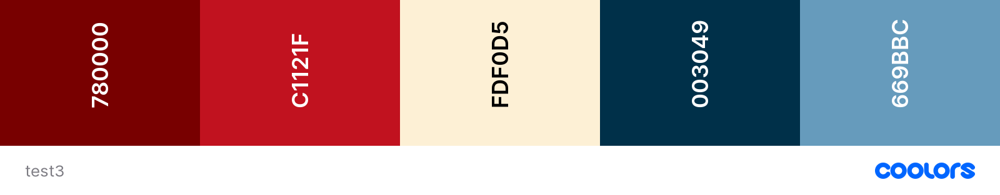
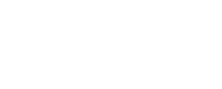

# Luxury Cat Hotel
## Description

The website shows a fictious cattery called "Cath's cats' Castle - Luxury Cat Hotel". The purpose of this website is to encourage users to book their cats to stay in the cattery. The website highlights the benefits and uniquness of the cattery, by focusing on beautiful photos of interior, rather than cats. 

This website was created to complete the first Milestone Project for the Code Institute's Diploma in Software Development (E-commerce Applications). 

## Deployment and Live demo

## User Experience (UX)
### User stories

#### First Time Visitor
- As a first time visitor, I what to know What sort of accomodation the website describes

- As a first time visitor, I would like get to know the people that run the cattery
- As a first time visitor, I want to be check the cost of accomodating my cat so I could compare easily with offers of other catteries
- As a first time visitor, I want to be able to check what services the cattery provieds
- As a first time visitor, I want to be able to see the phtotos of accomodation available
- As a first time visitor, I need to be able to check if cattery accomodates for complex healthcare and diet requirements
- As a first time visitor, I want to know the address and location of the cattery to be able to go and visit
- As a first time visitor, I want to be able to contact the owners' of the cattery for more information

#### The goals were accomplished in the following ways:
- The name of the website reffers to cats and is clearly visible in top left corner in mobile view and pc
- the home page describes history of the owners' of the cattery
- the prices page is accessible via nav bar button and prices are written in visualy simple cards form
- the services are accessible via nav bar button
- the photos of the rooms are available to view on the page rooms.html
- the page services describes that the cattery is accomodating all healthcare and diet requirements
- the contact page shows the google maps and full address of the cattery
- the contact page contains a simple form to fill in to get in touch with the owners'

#### Returining Visitor
- As a returning visitor, I need to access the booking form quickly

#### Goals were accomplished in the following ways
- the visitor can navigate from home page to booking using nav bar button

#### Frequent Visitor

### Brand and visual identity

#### Colors palette and Color inspiration

The inspiration for this website is warm dark interiors of some traditional English Coutnryside houses. I've chosen an inspiration from one of the photos posted on [One Kings Lane](https://www.onekingslane.com/live-love-home/english-cottage-style/) website and used [Coolors](https://coolors.co/) website to generatea a pallete. 

Dark color scheme of the website seems to be eye friendly and can evoke warmness and cosyness of the interiors presented. Different colors were applied to fonts, borders and other elements as decoration, to ad vibrancy and interest.

|On the basis of the above photo I generated 2 color pallettes: one with [vibrant colours](https://coolors.co/780000-c1121f-fdf0d5-003049-669bbc) and the other one with more [pastel colours](https://coolors.co/162b3d-2394b0-fefcf9-cd587a-352a3a).

The final decision was.... pastel?

 

#### Logo

Appropriately to the page story and page title - the logo has been created using [Canva website](https://www.canva.com/). The logo features an icon of a castle. 

Long version of the logo has been created using icon of the castle and TAN Mignon fonts. Fonts could not be used within website as the fonts were not available free.

#### Typography

[TAN Mingon](https://creativemarket.com/tantype/5831510-TAN-MIGNON?u=filepolitan) is font family used in logo only. This was chosen for very attractive visual effect, being inspired by art deco design. Unfortunately they could not have been used within the website as they didn't seem to be available free to use. 

Font family was chosen from popular styles of google fonts. The style of the headers is mimicking handwriting giving the viewer an impression of a personal touch from the owner of the website. Following this idea [Marck Script](https://fonts.google.com/specimen/Marck+Script?category=Handwriting#standard-styles) was chosen as the font for headers. The choise was taking into consideration that the user needs the fonts to be easy to read. Plain text requires much plainer fonts than headers. [Roboto](https://fonts.google.com/specimen/Roboto?query=robo) fonts for plain text. The plain text font was chosen from the fonts offered by google fonts as popular pairing. 

## Features

### Existing Features

### Future developement of the website and new features
- Two stages registration 

            1. Calendar (check if date available)
            2. Booking form with all details
- New Calendar page would consist of 9 calendars - one for each room. This page would replace Booking page in navigation - so the user would be directed to the calendar to choose the room and check the dates
- existing booking.html would become the booking form page - where the user would fill in all the details knowing that the dates are available
- pop up advert - to advertize special deals, to encourage users to fill in empty spaces between bookings or short notice cancellations
- Caruselle with more photos of the rooms, to enable the user to immerse in watching beautiful photos of interiors

## Testing

Google chrome dev tools

lighthouse to audit the site (efficiency)

https://validator.w3.org/

https://jigsaw.w3.org/css-validator

unicorn finder

### Issues and Bugsad

- style.css not accepting images to card background - as the file name were containing white space
- rooms-bs-img.html very wide white space on both sides (left and right) of the grid in max width view. Used Unicorn revealer to find which element is causing it. Found that .container has set max width 960px by bootstrap. Used chrome dev tools to test solution - set max-width to 100vw. This has removed the white space. Tested on other view port sizes. No white space left. Added class to adjust max-width.
- defauld bootstrap grid in rooms changed from 1 column to 3 columns which seemed inapropriate for tablets. Adjusted bootstrap classess and html structure to allow 1 or 2 or 3 columns depending of view port width. 
- toggler in nav bar not working, replaced bootstrap css stylesheet link and added js link, which solved the problem

### Removed Features

???

## Scalability

## Technologies

### Languages and Frameworks
- HTML
- CSS

### Tools used
- Bootstrap
- Google Chrome dev tools for debugging
- Google Lighthouse for audits
- vsCode to correct the code

## Media

???

## Acknowledgements

accessibility of icons for screen readers users 
https://fontawesome.com/v5.15/how-to-use/on-the-web/other-topics/accessibility

pattern for emails - input form validation for emails and other uses of pattern attribute
https://www.w3schools.com/tags/att_input_pattern.asp

UK counties drop down list

https://gist.github.com/olivertappin/4dcbf64e06aae132c12a8b9d302fae12

color inspiration
https://www.onekingslane.com/live-love-home/english-cottage-style/

Color palette
https://coolors.co/

compressing of the photos
https://tinypng.com/

created logo
https://www.canva.com/

Readme file followed the pattern in the below mentioned repositories and video

https://us02web.zoom.us/rec/play/zZzrdRcJ1Gz9isoaRTUcHNhB1VEqzkhcI4kkOUXEbTGTShtMaNQEpxYE7dW214K5X2OWveSRPLL-oWtA.5EMQT2YvoO2ZLIox?autoplay=true

https://github.com/Daisy-McG/MilestoneProject-1#frequent-visitor-goals

https://github.com/LigaMoon/Boredom-guide#technologies

https://github.com/jumboduck/Polygonal-Brewing-Co/blob/master/README.md

General help on how to use bootstrap's navbar's images, responsivness and styling, shared during Hackaton and applied in this project
Dave Horrocks & Brian Smyth